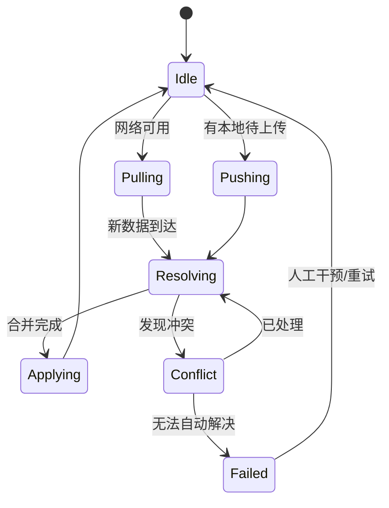

# Flutter 数据：离线同步与一致性实践

---

description: 深入解析 Flutter 应用在弱网或离线场景下的缓存策略、数据同步、冲突解决与一致性保障方法。
tag:

- Flutter
- 数据同步
- 离线能力
  sidebar: true

---

## 背景

移动应用在真实环境中常遭遇弱网或断网情况。良好的离线能力不仅改善用户体验，还能提升业务可用性与存留。Flutter 作为跨平台框架，需要在 Dart 层与原生层协同，实现缓存、同步、冲突解决等机制。本文从架构设计、缓存策略、同步流程和一致性控制四个维度展开。

## 1. 离线能力需求分析

| 场景       | 典型需求                       | 失败后果           |
| ---------- | ------------------------------ | ------------------ |
| ToB 业务   | 表单离线填写、上门签收         | 数据丢失、重复录入 |
| 内容消费类 | 离线阅读、媒体缓存             | 用户流失、差评     |
| 零售/巡检  | 高频扫描录入、断网仍可继续使用 | 工单停滞、销售损失 |
| IoT 控制   | 设备状态本地同步、延迟更新     | 控制失效、安全风险 |

构建离线能力需评估：数据量、更新频次、冲突概率、最终一致性要求。

## 2. 架构设计模式

### 2.1 离线优先（Offline-First）

```
┌───────────┐      ┌────────────┐      ┌────────────┐
│ Flutter UI│◀────▶│ Cache Layer│◀────▶│ Sync Engine │
└───────────┘      └────────────┘      └────────────┘
                                   ▲            │
                                   │            ▼
                               ┌────────────┐ ┌────────────┐
                               │ Conflict   │ │ Remote API │
                               │ Resolver   │ │ (REST/gRPC)│
                               └────────────┘ └────────────┘
```

- UI 首先读取缓存，保证快速响应。
- 同步引擎负责增量同步、重试、冲突合并。

### 2.2 双写日志（Event Sourcing）

- 本地事件日志记录用户操作（创建/更新/删除）。
- 与服务端日志比对，生成补偿或最终状态。
- 适合复杂业务，可还原历史操作。

## 3. 本地缓存与数据结构

### 3.1 缓存形式

| 类型      | 适用场景            | Flutter 实现                   |
| --------- | ------------------- | ------------------------------ |
| Key-Value | 设置、Token、配置   | `shared_preferences` + 加密    |
| 文档型    | JSON 数据、静态内容 | `hive`、`realm`                |
| 关系型    | 复杂查询、统计      | `drift`、`sqlite`              |
| 文件型    | 图片、媒体、离线包  | `path_provider` + 自建缓存策略 |

### 3.2 数据版本与元信息

缓存表应包含：

- `updatedAt`：本地更新时间。
- `syncState`：`pending / syncing / synced / failed`。
- `checksum`：数据摘要，快速判断是否变更。
- `origin`：数据来源（本地创建/服务端下发）。

```dart
class OfflineRecord {
  final String id;
  final Map<String, dynamic> payload;
  final DateTime updatedAt;
  final SyncState syncState;
  final String checksum;

  OfflineRecord copyWith({
    Map<String, dynamic>? payload,
    SyncState? syncState,
  }) => OfflineRecord(
        id: id,
        payload: payload ?? this.payload,
        updatedAt: DateTime.now(),
        syncState: syncState ?? this.syncState,
        checksum: calculateChecksum(payload ?? this.payload),
      );
}
```

## 4. 同步流程设计

### 4.1 同步状态机



### 4.2 增量同步策略

- **时间戳差异**：拉取 `updatedAfter` > 上次同步时间的数据。
- **版本号**：服务端维护递增版本，客户端记录 `lastSyncedVersion`。
- **订阅推送**：结合 WebSocket/消息队列，实时通知变更。

### 4.3 重试与节流

```dart
class SyncScheduler {
  final Duration base = const Duration(seconds: 5);
  int retry = 0;

  Duration nextBackoff() {
    retry = (retry + 1).clamp(0, 5);
    return base * pow(2, retry).toInt();
  }
}
```

- 重试次数达到阈值后进入 `failed`，等待手动干预。
- 使用 `connectivity_plus` 监听网络变化，恢复时立即触发同步。

## 5. 冲突检测与一致性

### 5.1 冲突类型

| 类型       | 描述                       | 解决策略                       |
| ---------- | -------------------------- | ------------------------------ |
| 同字段冲突 | 多端同时修改同一字段       | 时间戳优先、版本优先、手动合并 |
| 结构冲突   | 服务端新增字段、本地旧结构 | 迁移脚本、兼容解析             |
| 删除冲突   | 一端删除、另一端修改       | 谁先谁后策略、软删除恢复       |

### 5.2 合并策略

```dart
Map<String, dynamic> mergeRecord(
  Map<String, dynamic> local,
  Map<String, dynamic> remote,
) {
  final result = <String, dynamic>{};
  for (final key in {...local.keys, ...remote.keys}) {
    if (!local.containsKey(key)) {
      result[key] = remote[key];
    } else if (!remote.containsKey(key)) {
      result[key] = local[key];
    } else {
      result[key] = resolveField(key, local[key], remote[key]);
    }
  }
  return result;
}

dynamic resolveField(String key, dynamic localValue, dynamic remoteValue) {
  if (localValue is num && remoteValue is num) {
    return remoteValue; // 以服务端为准
  }
  if (localValue is Map && remoteValue is Map) {
    return mergeRecord(localValue, remoteValue);
  }
  return remoteValue;
}
```

### 5.3 手动冲突处理

- 对高风险字段（如金额、库存）弹出对话框提示。
- 提供历史版本对比，允许用户选择保留版本。
- 记录冲突日志，便于事后审计。

## 6. UI 体验优化

- 显示离线提示、同步状态。
- 对待上传记录提供撤销/编辑入口。
- 使用 `ValueListenableBuilder` 或 `StreamBuilder` 实时刷新状态。
- 运用乐观更新（Optimistic UI），提升响应速度。

```dart
class SyncStatusBanner extends StatelessWidget {
  final SyncStatus status;

  const SyncStatusBanner({required this.status});

  @override
  Widget build(BuildContext context) {
    switch (status) {
      case SyncStatus.syncing:
        return const Banner(message: '同步中', location: BannerLocation.topEnd);
      case SyncStatus.failed:
        return Banner(
          message: '同步失败，点击重试',
          location: BannerLocation.topEnd,
          color: Colors.red,
        );
      default:
        return const SizedBox.shrink();
    }
  }
}
```

## 7. 测试与监控

- 单元测试：模拟冲突合并、断网重试逻辑。
- 集成测试：使用 `integration_test` + stub 服务器重放真实场景。
- 指标监控：统计同步成功率、冲突率、平均延迟。
- 日志：记录同步批次、请求参数、错误码，便于追踪。

## 8. 案例参考

- **离线巡检**：Flutter + Drift 存储表单，返回有网后批量上传。
- **新闻资讯**：预下载每日内容，使用 `cache_manager` 控制缓存大小。
- **零售 POS**：本地库存快照 + 冲突处理，多门店合并时以总部库存为准。

## 总结

构建离线同步能力需端到端设计：

1. 选择合适的数据模型与缓存方案。
2. 设计健壮的同步引擎，支持增量、重试与冲突解决。
3. 优化 UI 体验，增强用户对同步状态的感知。
4. 建立完善的测试和监控体系，持续追踪一致性指标。

根据业务需求灵活组合策略，才能确保 Flutter 应用在离线场景下依旧稳定可靠，提供一致的用户体验。
