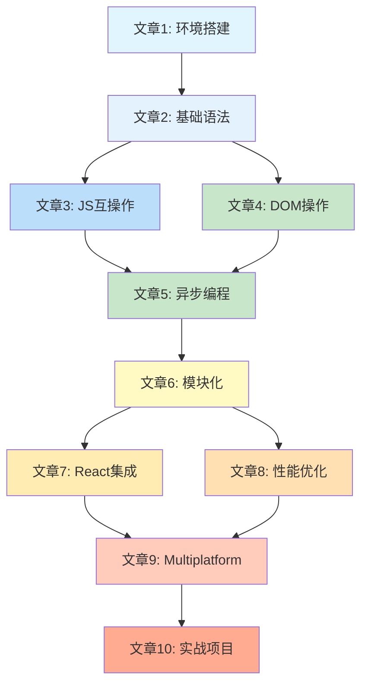

# Kotlin/JS 系列文章索引

## 系列概述

本系列文章全面介绍 Kotlin/JS 开发，从基础入门到高级应用，帮助开发者掌握使用 Kotlin 编写 JavaScript 应用程序的技能。系列采用渐进式学习路径，适合不同层次的读者。

## 文章列表

### 📚 基础篇

#### 1. [Kotlin/JS 简介与环境搭建](./KotlinJS-简介与环境搭建.md)

- **难度**：⭐⭐
- **阅读时间**：15 分钟
- **主要内容**：了解 Kotlin/JS 的基本概念，搭建开发环境，创建第一个项目
- **前置知识**：基础 Kotlin 语法，HTML/CSS 基础
- **核心要点**：
  - Kotlin/JS 的优势与应用场景
  - 开发环境配置（JDK、IDE、Gradle）
  - 项目创建与结构解析
  - 基本构建与运行流程

#### 2. [Kotlin/JS 基础语法与类型映射](./KotlinJS-基础语法与类型映射.md)

- **难度**：⭐⭐⭐
- **阅读时间**：20 分钟
- **主要内容**：掌握 Kotlin/JS 的语法特性，理解类型系统映射
- **前置知识**：Kotlin 基础语法，JavaScript 基础
- **核心要点**：
  - Kotlin 类型与 JavaScript 类型的映射关系
  - 集合类型的转换与操作
  - 空安全在 JavaScript 环境中的处理
  - 标准库函数的使用

### 🔧 进阶篇

#### 3. [Kotlin/JS 与 JavaScript 互操作](./KotlinJS-与JavaScript互操作.md)

- **难度**：⭐⭐⭐⭐
- **阅读时间**：25 分钟
- **主要内容**：学习如何在 Kotlin 中调用 JavaScript 代码，处理第三方库
- **前置知识**：前两篇文章内容，JavaScript 模块系统
- **核心要点**：
  - external 关键字的使用
  - JavaScript 模块导入与导出
  - 动态类型与类型安全
  - 第三方库的封装与调用

#### 4. [Kotlin/JS DOM 操作与 Web API 集成](./KotlinJS-DOM操作与WebAPI集成.md)

- **难度**：⭐⭐⭐⭐
- **阅读时间**：30 分钟
- **主要内容**：掌握 DOM 操作，集成浏览器 API，处理用户交互
- **前置知识**：JavaScript DOM 操作，事件处理基础
- **核心要点**：
  - DOM 元素操作与事件处理
  - 浏览器 API 调用
  - CSS 样式操作
  - 表单处理与验证

#### 5. [Kotlin/JS 异步编程与协程](./KotlinJS-异步编程与协程.md)

- **难度**：⭐⭐⭐⭐⭐
- **阅读时间**：35 分钟
- **主要内容**：深入理解 Kotlin 协程在 JS 环境中的应用，处理异步操作
- **前置知识**：Kotlin 协程基础，JavaScript 异步编程
- **核心要点**：
  - 协程在 JavaScript 环境中的实现
  - Promise 与协程的互操作
  - 流式数据处理
  - 错误处理与异常管理

#### 6. [Kotlin/JS 模块化与依赖管理](./KotlinJS-模块化与依赖管理.md)

- **难度**：⭐⭐⭐⭐
- **阅读时间**：25 分钟
- **主要内容**：掌握模块系统，管理项目依赖，优化构建流程
- **前置知识**：Gradle 基础，npm 包管理
- **核心要点**：
  - JavaScript 模块系统（CommonJS、ESM、UMD）
  - Gradle 依赖配置
  - 代码分割与懒加载
  - 版本管理与发布

### 🚀 高级篇

#### 7. [Kotlin/JS React 集成与组件开发](./KotlinJS-React集成与组件开发.md)

- **难度**：⭐⭐⭐⭐⭐
- **阅读时间**：40 分钟
- **主要内容**：学习使用 Kotlin/JS 开发 React 应用，构建现代 Web 界面
- **前置知识**：React 基础，前六篇文章内容
- **核心要点**：
  - React 组件开发（函数组件与类组件）
  - 状态管理与 Props 传递
  - 生命周期与 Hooks
  - 样式处理与 CSS-in-JS

#### 8. [Kotlin/JS 性能优化与调试技巧](./KotlinJS-性能优化与调试技巧.md)

- **难度**：⭐⭐⭐⭐⭐
- **阅读时间**：30 分钟
- **主要内容**：掌握性能优化策略，学习调试技巧，解决常见问题
- **前置知识**：Web 性能优化基础，浏览器开发者工具
- **核心要点**：
  - 代码分割与懒加载
  - 内存管理与垃圾回收
  - 构建优化策略
  - 调试工具与技巧

#### 9. [Kotlin/JS 与 Kotlin Multiplatform 协同开发](./KotlinJS-与KotlinMultiplatform协同开发.md)

- **难度**：⭐⭐⭐⭐⭐
- **阅读时间**：35 分钟
- **主要内容**：了解多平台开发，实现代码共享，构建跨平台应用
- **前置知识**：Kotlin Multiplatform 基础，前八篇文章内容
- **核心要点**：
  - Multiplatform 项目结构
  - 共享代码设计原则
  - 平台特定实现
  - expect/actual 机制

#### 10. [Kotlin/JS 实战项目与最佳实践](./KotlinJS-实战项目与最佳实践.md)

- **难度**：⭐⭐⭐⭐⭐
- **阅读时间**：45 分钟
- **主要内容**：综合应用所学知识，构建完整项目，总结最佳实践
- **前置知识**：全系列文章内容
- **核心要点**：
  - 完整项目架构设计
  - 用户认证系统实现
  - 任务管理系统开发
  - 部署策略与优化

## 学习路径建议

### 🎯 初学者路径

1. **文章 1** → **文章 2** → **文章 3** → **文章 4**
2. 完成后可以尝试构建简单的 Web 应用
3. 重点关注：环境搭建、基础语法、DOM 操作

### 🎯 中级开发者路径

1. 快速浏览**文章 1-2**（重点看差异部分）
2. 深入学习**文章 3-6**
3. 根据需要选择**文章 7**或**文章 8**
4. 重点关注：JavaScript 互操作、异步编程、模块化

### 🎯 高级开发者路径

1. 直接从**文章 5**开始
2. 重点学习**文章 7-9**
3. 参考**文章 10**的最佳实践
4. 重点关注：协程、React 集成、Multiplatform

## 配套资源

### 🛠️ 开发工具

- [IntelliJ IDEA](https://www.jetbrains.com/idea/) - 推荐 IDE
- [VS Code](https://code.visualstudio.com/) - 轻量级选择
- [Gradle](https://gradle.org/) - 构建工具
- [WebStorm](https://www.jetbrains.com/webstorm/) - Web 开发专用 IDE

### 📖 参考资料

- [Kotlin/JS 官方文档](https://kotlinlang.org/docs/js-overview.html)
- [Kotlin 语言文档](https://kotlinlang.org/docs/home.html)
- [MDN Web 文档](https://developer.mozilla.org/) - Web API 参考
- [React 官方文档](https://react.dev/) - React 开发指南

### 🎯 示例项目

- [Kotlin/JS 示例仓库](https://github.com/Kotlin/kotlin-wrappers)
- [React-Kotlin 示例](https://github.com/JetBrains/kotlin-wrappers/tree/master/examples/react)
- [Multiplatform 示例](https://github.com/Kotlin/kmm-samples)

## 文章关联图

## 技能进阶路径

### 🌱️ 基础技能

- Kotlin/JS 环境配置
- 基本语法与类型系统
- DOM 操作与事件处理
- 简单的异步操作

### 🌿️ 中级技能

- JavaScript 库集成
- 复杂异步编程
- 模块化开发
- 性能优化基础

### 🌳️ 高级技能

- React 组件开发
- 跨平台代码共享
- 高级性能优化
- 大型项目架构

### 🌴️ 专家技能

- Multiplatform 架构设计
- 高级调试技巧
- 生产环境部署
- 团队协作最佳实践

## 常见问题

### Q: 我需要先学习 JavaScript 吗？

A: 建议有基础的 JavaScript 知识，但不是必需的。Kotlin/JS 提供了良好的抽象层。

### Q: Kotlin/JS 生成的代码体积大吗？

A: 现代 Kotlin/JS 编译器已经大幅优化，通过 Tree Shaking 可以生成紧凑的代码。

### Q: 可以在现有 JavaScript 项目中使用 Kotlin 吗？

A: 可以，Kotlin/JS 支持渐进式集成，可以与现有 JavaScript 代码无缝协作。

### Q: Kotlin/JS 支持哪些浏览器？

A: 支持所有现代浏览器，包括 Chrome、Firefox、Safari、Edge 等。

### Q: 如何选择学习路径？

A: 根据你的现有知识水平选择对应的学习路径，初学者建议从基础篇开始。

## 贡献指南

如果您发现文章中的错误或有改进建议，欢迎提交 Issue 或 Pull Request。

### 文章结构

- 每篇文章遵循统一的 Markdown 格式
- 包含适当的代码块和示例
- 提供相关资源链接
- 保持与现有文章风格一致

### 提交规范

- 使用清晰的提交信息
- 遵循项目的代码风格
- 提供充分的测试用例
- 更新相关文档

## 更新日志

- **2024-01-15**: 系列文章创建完成
- **2024-01-20**: 添加学习路径建议
- **2024-01-25**: 更新配套资源链接
- **2024-02-01**: 完善文章关联图
- **2024-02-10**: 添加技能进阶路径

## 社区资源

### 🌐 在线社区

- [Kotlin Slack](https://kotlinlang.slack.com/) - Kotlin 官方 Slack 频道
- [Kotlin Discord](https://discord.gg/kotlin) - Kotlin Discord 服务器
- [Stack Overflow](https://stackoverflow.com/questions/tagged/kotlin-js) - 技术问答

### 📚 学习资源

- [Kotlin 官方博客](https://blog.jetbrains.com/kotlin/)
- [Kotlin Weekly](https://kotlinweekly.net/) - Kotlin 周报
- [Kotlin YouTube 频道](https://www.youtube.com/c/Kotlin) - 官方视频教程

### 🎯 实践平台

- [Kotlin Playground](https://play.kotlinlang.org/) - 在线 Kotlin 编辑器
- [Kotlin/JS 在线示例](https://kotlinlang.org/docs/js-overview.html#try-kotlinjs-online) - 在线 JS 示例

---

_本系列文章持续更新中，欢迎关注最新内容！如果您有任何问题或建议，请随时联系我们。祝您学习愉快！_
